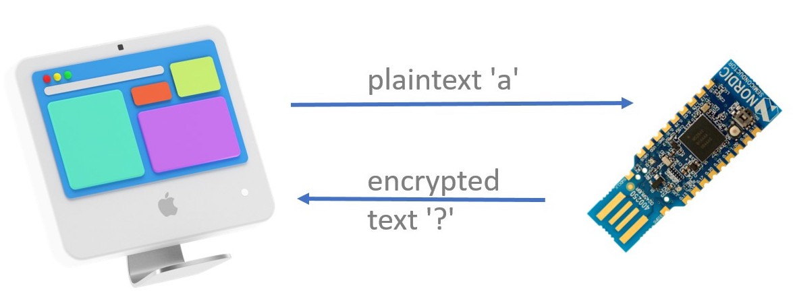

# Radio Puzzle

Your task in this section is to decrypt the [substitution cipher] encrypted *ASCII* string stored in the Dongle using one of the stack-allocated maps in the [`heapless`] crate. The string has been encrypted using *simple substitution*.

## Preparing the Dongle

[substitution cipher]: https://en.wikipedia.org/wiki/Substitution_cipher
[`heapless`]: https://docs.rs/heapless

✅ Flash the `puzzle-fw` program on the Dongle. Follow the instructions from the [nRF52840 Dongle](./nrf52-radio-dongle.md) section but flash the `puzzle-fw` program instead of the `loopback-fw` one -- don't forget to put the Dongle in bootloader mode (pressing the reset button) before invoking `nrfdfu`.

Like in the previous sections the Dongle will listen for radio packets -- this time over *channel 25* -- while also logging messages over a USB/serial interface. It also prints a `.` periodically so you know it's still alive.

## Sending Messages and Receiving the Dongle's Responses

✅ Open the [`nrf52-code/radio-app`](../../nrf52-code/radio-app) folder in VS Code; then open the `src/bin/radio-puzzle.rs` file. Run the program.

This will send a zero sized packet `let msg = b""` to the dongle. It does this using a special function called `dk::send_recv`. This function will:

1. Determine a unique address for your nRF52840 (Nordic helpfully bake a different random address into every nRF52 chip they make)
2. Construct a packet where the first six bytes are the unique address, and the remainder are the ones you passed to the `send_recv()` function
3. Use the `Radio::send()` method to wait for the channel to be clear (using a *Clear Channel Assessment*) before actually sending the packet 
4. Use the `Radio::recv_timeout()` method to wait for a reply, up to the given number of microseconds specified
5. Check that the first six bytes in the reply match our six byte address
   a. If so, the remainder of the reply is returned as the `Ok` variant
   b. Otherwise, increment a retry counter and, if we have run out of retry attempts, we return the `Err` variant
   c. Otherwise, we go back to step 2 and try again.

This function allows communication with the USB dongle to be relatively robust, even in the presence of other devices on the same channel. However, it's not perfect and sometimes you will run out of retry attempts and your program will need to be restarted.

❗ The Dongle responds to the DK's requests wirelessly (i.e. by sending back radio packets) as well. You'll see the dongle responses printed by the DK. This means you don't have to worry if serial-term doesn't work on your machine.

✅ Try sending one-byte sized packets.
✅ Try sending longer packets.

What happens?

❗ The Dongle responds to the DK's requests wirelessly (i.e. by sending back radio packets) as well. You'll see the dongle responses printed by the DK. This means you don't have to worry if serial-term doesn't work on your machine.

    
Answer

The Dongle will respond differently depending on the length of the payload in the incoming packet:

- On zero-sized payloads (i.e. packets that only contain the device address and nothing else) it will respond with the encrypted string.
- On one-byte sized payloads it will respond with the *direct* mapping from the given *plaintext* letter (single `u8` value) to the corresponding *ciphertext* letter (another `u8` value).
- On payloads of any other length the Dongle will respond with the string `correct` if it received the correct secret string, otherwise it will respond with the string `incorrect`.

The Dongle will always respond with payloads that are valid UTF-8 so you can use `str::from_utf8` on the response packets. However, do not attempt to look inside the raw packet, as it will contain six random address bytes at the start, and they will not be valid UTF-8. Only look at the `&[u8]` that the `send_recv()` function returns, and treat the `Packet` as just a storage area that you don't look inside.

This step is illustrated in `src/bin/radio-puzzle-1.rs`

From here on, the exercise can be solved in multiple ways. If you have an idea on how to go from here and what tools to use, you can work on your own. If you don't have an idea what to do next or what tools to use, we'll provide a guide on the next page.
