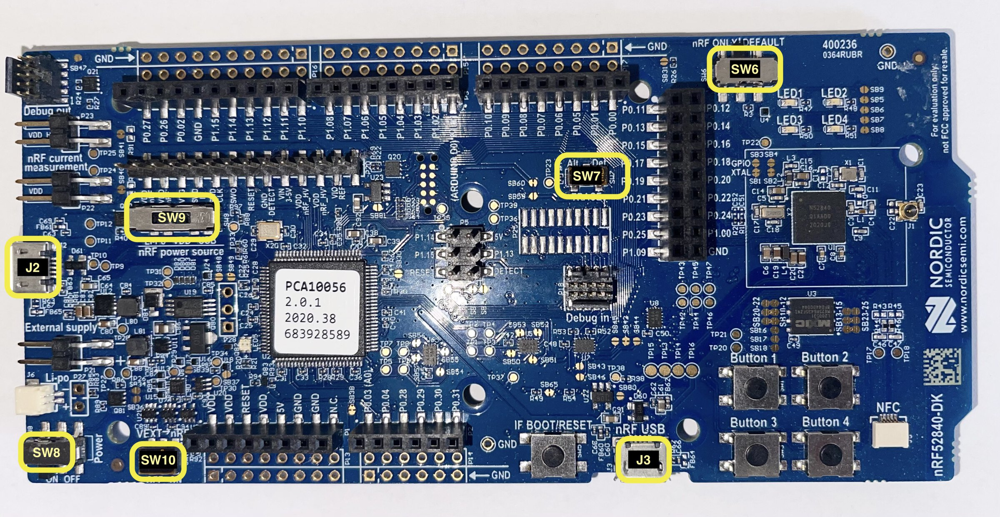

# nRF52840 Development Kit (DK)

This is the larger development board.

The board has two USB ports: J2 and J3 and an on-board J-Link programmer / debugger. USB port J3 is
the nRF52840's USB port. Connect the Development Kit to your computer using the **J2** port.
You can also refer to the image below to see the location of the different components on the board.

The development board actually has two chips. One is the nRF52840 target chip,
and the other contains a special firmware which transforms it into a J-Link debugger. Your computer will
communicate via USB with the J-Link, which will in turn use the SWD protocol to interface
with the target chip via a JTAG interface. All of this avoids the need for an external probe.

💬 These directions assume you are holding the board "horizontally" with components (switches, buttons and pins) facing up. In this position, rotate the board, so that its convex shaped short side faces right. You'll find one USB connector (J2) on the left edge, another USB connector (J3) on the bottom edge and 4 buttons on the bottom right corner.

The board has several switches to configure its behavior. The out of the box configuration is the one we want. If the above instructions didn't work for you, check the position of the following switches:

- SW6 is set to the DEFAULT position (to the right - nRF = DEFAULT).
- SW7 (protected by Kapton tape) is set to the Def. position (to the right - TRACE = Def.).
- SW8 is set to the ON (to the left) position (Power = ON)
- SW9 is set to the VDD position (center - nRF power source = VDD)
- SW10 (protected by Kapton tape) is set to the OFF position (to the left - VEXT -> nRF = OFF).



## Connecting the board

Depending on the OS, observing the board might require different steps and will yield different output.

### Windows

When the nRF52-DK is connected to your PC it shows up as a removable USB Flash Drive (named JLINK) and also as a USB Serial Device (COM port) in the Device Manager under the Ports section.

### Linux

When the nRF52-DK is connected to your PC it shows up as a USB device under `lsusb` or `cyme`. The
device will have a VID of `1366` and a PID of `10xx` or `01xx`, where `x` can vary:

```console
$ cyme
(..)
  3  20  0x1366 0x1061 J-Link                      001050238928 -       12.0 Mb/s
```

```console
$ lsusb
(..)
Bus 001 Device 014: ID 1366:1051 SEGGER 4-Port USB 2.0 Hub
```

The device will also show up in the `/dev` directory as a `ttyACM` device:

```console
$ ls -l /dev/serial/by-id/*
lrwxrwxrwx - root  2 Mar 14:31 /dev/serial/by-id/usb-SEGGER_J-Link_001050238928-if00 -> ../../ttyACM0
lrwxrwxrwx - root  2 Mar 14:31 /dev/serial/by-id/usb-SEGGER_J-Link_001050238928-if02 -> ../../ttyACM1
```

### macOS

When the nRF52-DK is connected to your Mac it shows up as a removable USB flash drive (named JLINK) on the Desktop, and also a USB device named "J-Link" when executing `ioreg -p IOUSB -b -n "J-Link"`.

```console
$ ioreg -p IOUSB -b -n "J-Link"
(...)
  | +-o J-Link@14300000  <class AppleUSBDevice, id 0x10000606a, registered, matched, active, busy 0 $
  |     {
  |       (...)
  |       "idProduct" = 4117
  |       (...)
  |       "USB Product Name" = "J-Link"
  |       (...)
  |       "USB Vendor Name" = "SEGGER"
  |       "idVendor" = 4966
  |       (...)
  |       "USB Serial Number" = "000683420803"
  |       (...)
  |     }
  |
```

The device will also show up in the `/dev` directory as `tty.usbmodem<USB Serial Number>`:

```console
$ ls /dev/tty.usbmodem*
/dev/tty.usbmodem0006834208031
```

## The nRF52840 chip

Both development boards have an nRF52840 microcontroller. Here are some details that are relevant to these exercises:

- single core ARM Cortex-M4 processor clocked at 64 MHz
- 1 MB of Flash (at address `0x0000_0000`)
- 256 KB of RAM (at address `0x2000_0000`)
- IEEE 802.15.4 and BLE (Bluetooth Low Energy) compatible radio
- USB controller (device function)

## Flashing a test application

To verify that our on-board J-Link is working properly and our board is ready for the
following exercises, we will build and flash a small hello world application onto it.

We previously installed the `thumbv7em-none-eabihf` target in the [software preparation](./tools.md)
chapter so we are able to compile this application for the target now.

The `nrf52-code` folder contains all of our exercises. The `nrf52-code/hal-app` folder contains
various smaller applications we can use to quickly test the board.

Use the following command inside the `nrf52-code/hal-app` folder to build and flash the hello world
application:

```sh
cargo run --bin hello --release
```

You should now see something like this in you terminal:

```console
$ cargo run --bin hello
   Compiling radio_app v0.0.0 (/Users/jonathan/Documents/ferrous-systems/rust-exercises/nrf52-code/radio-app)
    Finished `dev` profile [optimized + debuginfo] target(s) in 0.36s
     Running `probe-rs run --chip=nRF52840_xxAA --allow-erase-all --log-format=oneline target/thumbv7em-none-eabihf/debug/hello`
      Erasing ✔ 100% [####################]  12.00 KiB @  18.70 KiB/s (took 1s)
  Programming ✔ 100% [####################]  12.00 KiB @  14.34 KiB/s (took 1s)
  Finished in 1.48s
Hello, world!
`dk::exit()` called; exiting ...
```

With one command, we built the application, flashed it, and can now also see logs coming from it.
Usually, `cargo run` will run the built application for the host machine. However, `cargo` allows
customizing this runner. We actually did this in the `.cargo/config.toml` file
and set the runner to `probe-rs`.

`probe-rs` is the flasher tool we use to flash the hello world application onto the chip. It
talks with our on-board J-Link probe for us, taking care of the flashing process, and also performing
the collection of logs received after the target software has started running.

We will now briefly look at the [references and resources](./references-resources.md) before
moving onto the radio exercise.
