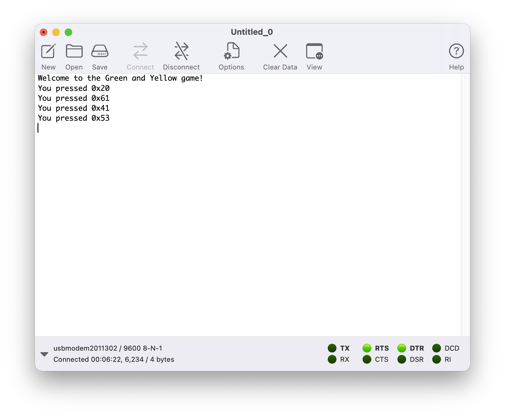

# Porting Green and Yellow

Now we have a sense of how to run programs on our board, and how to use the
Hardware Abstraction Layer (via the Board Support Package) to control the
hardware, let's write a game!

This part of this exercise is based around the [Green and Yellow] exercise which
you may have completed on your desktop computer in an earlier training. You can
either complete that exercise first to develop the game algorithm, or you can
copy-paste our sample algorithm and concentrate on porting it to run on the
STM32 board.

[Green and Yellow]: ../fundamentals/green-yellow-game.md

We are going to take the `calc_green_and_yellow` function (either one you have written, or by copying it from the [solution folder for that earlier example]) and bring it into an STM32 program. We're then going to write a new harness to drive the game that uses the USART1 peripheral, and the on-board UART to USB Serial interface.

[solution folder for that earlier example]: ../../../exercise-solutions/green-yellow/

## The USART Peripheral

The STM32U5A5 microcontroller has several UART peripherals (*Universal Asynchronouse Receiver/Transmitter*). Because these peripherals also support *Synchronous* mode (i.e. sending or receiving a clock signal along with the data), ST Micro call them "USART".

We are using `USART1`, and the `nucleo-u5a5zj-bsp` BSP helpfully has a driver for it. This driver is configured to run the UART at 9600 baud, 8 stop bits, no parity and 1 stop bit.

Look in the BSP documentation and you will see that your `NonSecureBoard` contains a `hal::usart::Driver` object. Before the UART will work, you need to call the `configure` method on the driver.

```rust, ignore
let mut board = bsp::NonSecureBoard::new();
board.usart1.configure(bsp::APB2_PERIPH_CLK_HZ);
```

The UART driver belongs to the HAL, and therefore doesn't know board-specific things like "what clock speed is the board running at". We must therefore pass in the board's clock speed using a handy `const` defined by the BSP. If you get this wrong, the data will come out of the UART and the wrong speed and your terminal won't be able to make sense of it.

Ah yes, we're going to need a Serial Terminal.

In the olden days we might have had an RS-232 connector, which we could wire up to an IBM PC, or a [Digital VT100 Serial Terminal](https://en.wikipedia.org/wiki/VT100), or perhaps even a [Teletypewriter](https://en.wikipedia.org/wiki/Teletype_Model_33).

These days though, ST Micro was kind enough to include a UART to USB Serial convertor chip on the NUCLEO-U5A5 board. It uses the same USB interface that we've been programming the board with.

If you have a favourite Serial Terminal program on your computer, feel free to use that. I quite like `pyserial-miniterm` that come with the Python pyserial package. Linux users might prefer `minicom`. Windows users often use `PuTTY`.

If you have Linux or macOS, you should have an entry in `/dev/` that corresponds to the virtual USB Serial Port. On Windows, it will have been assigned a COM port, like `COM27`, which you can see in Device Manager.

✅ To test your serial port, run the `standalone-green-yellow` program, and connect your Serial Terminal to the virtual USB Serial Port, (using 9600 baud).

```console
$ cargo run --bin standalone-green-yellow
```

On macOS, I would run:

```console
$ /Users/jonathan/.local/pipx/venvs/pyserial/bin/pyserial-miniterm

--- Available ports:
---  1: /dev/cu.Bluetooth-Incoming-Port 'n/a'
---  2: /dev/cu.debug-console 'n/a'
---  3: /dev/cu.usbmodem2011302 'STLINK-V3'
--- Enter port index or full name: 3
--- Miniterm on /dev/cu.usbmodem2011302  9600,8,N,1 ---
--- Quit: Ctrl+] | Menu: Ctrl+T | Help: Ctrl+T followed by Ctrl+H ---
Welcome to the Green and Yellow game!
You pressed 0x20
You pressed 0x48
```

Or I might use a GUI tool like [CoolTerm](https://freeware.the-meiers.org). However, you might find it's going to [struggle with the Green/Yellow emoji].



[struggle with the Green/Yellow emoji]: #my-coloured-blocks-look-wrong

## Creating the game

Inside the `stm32-code/standalone-app/src/bin/standalone-green-yellow.rs` file, complete the following steps:

1. Define a constant `NUM_DIGITS: usize` with the value `4`
1. Bring over the `fn calc_green_and_yellow(guess: &[u8; NUM_DIGITS], secret: &[u8; NUM_DIGITS]) -> [char; NUM_DIGITS]` function from the earlier [Green and Yellow] exercise.
1. Generate 4 random digits - our 'secret'
1. Create loops for the game, the guess and for each digit
1. Read four bytes from the UART into a `[u8; NUM_DIGITS]` array (and give an error if the user makes a mistake)
1. Run the calculation routine above and print the coloured blocks for each guess
1. Start a new game if all the blocks are green (or, equally, if `guess == secret`)
1. Play the game!

If that's enough guidance for you, feel free to crack on! If you'd like to work on the problem step by step, see the next section.

If all else fails, we have provided a [complete solution](../../../stm32-code/standalone-app/src/bin/standalone-green-yellow-complete.rs) for this exercise.

## Step by Step Solution

### The Algorithm

You can follow the guidance in the earlier [Green and Yellow] exercise to write the algorithm - it has step by step guidance. Or you can copy this one:

<details>
<summary>An example algorithm</summary>

```rust
pub const NUM_DIGITS: usize = 4;

pub fn calc_green_and_yellow(
    guess: &[u8; NUM_DIGITS],
    secret: &[u8; NUM_DIGITS],
) -> [char; NUM_DIGITS] {
    let mut result = ['⬜'; NUM_DIGITS];
    let mut secret_used = [false; NUM_DIGITS];

    for i in 0..NUM_DIGITS {
        if guess[i] == secret[i] {
            // that's a match
            result[i] = '🟩';
            // don't match this secret digit again
            secret_used[i] = true;
        }
    }

    for index_g in 0..NUM_DIGITS {
        // only process guess digits that weren't a perfect match
        if result[index_g] != '🟩' {
            for index_s in 0..NUM_DIGITS {
                // does the guess digit match that secret digit (and is that secret digit unused so far?)
                if (guess[index_g] == secret[index_s]) && !secret_used[index_s] {
                    // this is a correct digit but in the wrong place
                    result[index_g] = '🟨';
                    // don't match this secret digit again
                    secret_used[index_s] = true;
                    // move to next guess digit now
                    break;
                }
            }
        }
    }

    result
}
```

</details>

### Generating Random Digits

The `NonSecureBoard` object has a field called `rng`, which has a [`random_range` method](https://docs.rs/rand/0.10.2/rand/trait.RngExt.html#method.random_range).

<details>
<summary>Creating four random digits</summary>

```rust, ignore
let mut secret = [0u8; NUM_DIGITS];
for digit in secret.iter_mut() {
    *digit = board.rng.random_range(1..=9);
}
```

</details>

### The Game Loops

We'll need three nested loops here:

* A `loop` for the "games"
* A `loop` for "guesses" within the current game
* A `loop` for fetching "digits" within the current guess

<details>
<summary>The Game Loops</summary>

```rust, ignore
// Loop for each Game
loop {
    let mut secret = [0u8; NUM_DIGITS];
    for digit in secret.iter_mut() {
        *digit = board.rng.random_range(1..=9);
    }

    // Loop for each Guess within the Game
    loop {
        let mut guess = [0u8; NUM_DIGITS];

        // Loop for each Digit within the Guess
        let mut i = 0;
        loop {

            // TODO: read valid digits into `guess[i]` and increment i

            if i == NUM_DIGITS {
                break;
            }
        }

        // TODO: do the calculation and print the result

        if guess == secret {
            _ = writeln!(board.usart1, "Well done!!");
            break;
        }
    }
}
```

</details>

### Reading from the UART

The template shows you the `board.usart1.rx_char_blocking()` API for reading bytes from the UART. Assuming your Serial Terminal is from the last 60 years or so (and you stick to the numeric keys on your keyboard) these will be ASCII values. But how do you turn an ASCII `b'1'` (or `0x31`) into the integer `1`?

I like to do it the same way I did in my C programs - by taking the ASCII digit, checking it is in range, and then subtracting `b'0'` from it. Helpfully, the ASCII digits 0 - 9 are in order in the ASCII table (and in Unicode too).

<details>
<summary>Reading digits from the UART</summary>

```rust, ignore
let mut i = 0;
loop {
    _ = write!(board.usart1, "\nEnter digit {}: ", i);
    let ch = board.usart1.rx_char_blocking();
    match ch {
        b'1'..=b'9' => {
            guess[i] = ch - b'0';
            board.usart1.tx_char_blocking(ch);
            i += 1;
            if i == NUM_DIGITS {
                break;
            }
        }
        _ => {
            _ = writeln!(
                board.usart1,
                "{:?} is not valid, try again",
                ch as char
            );
        }
    }
}
```

</details>

### My Coloured Blocks look wrong!

Some Serial Terminals cannot handle the Green, Yellow and Grey block emojis we use in our reference solution. If so, feel free to replace them with the ``G``, ``Y`` and ``_`` characters, or something similar.

The good news is that the game probably now will work on a [Teletype](https://en.wikipedia.org/wiki/Teletype_Model_33).
