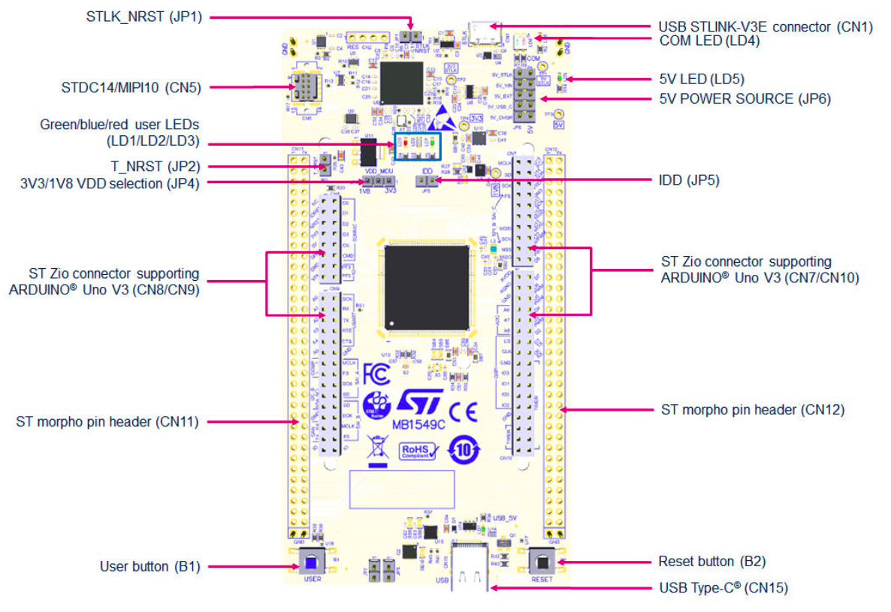

# STM32 Introduction and Preparation

This chapter contains the introduction and preparation for the STM32-based
exercises.

## Required Hardware

- An [ST Micro NUCLEO-U5A5ZJ-Q] board
- A micro-USB cable
  - ❗️ make sure you're using a micro-USB cable which can transmit data (some
    are charging-only; these are not suitable for these exercises)
- 1 corresponding available USB port on your laptop / PC (you can use a USB hub
  if you don't have enough ports)

[ST Micro NUCLEO-U5A5ZJ-Q]: https://www.st.com/en/evaluation-tools/nucleo-u5a5zj-q.html

In our STM32-focussed exercises we will develop programs for the NUCLEO-U5A5ZJ-Q
using its on-board ST-Link debugger.

## Board preparation

The NULCEO-U5A5 board has two USB ports: a micro-USB port (CN1) and an USB
Type-C port (CN15). It also has on-board ST-Link programmer / debugger. The
micro-USB port is connected to the ST-Link and is the one you should connect to
your computer. You can also refer to the image below to see the location of the
different components on the board.

The development board actually has two chips. One is the STM32U5A5ZJ-Q target chip,
and the other contains a special firmware which transforms it into a ST Micro
ST-Link debugger probe. Your computer will communicate via USB with the ST-Link,
which will in turn use the SWD protocol to interface with the target chip. All
of this avoids the need for an external probe.

💬 These directions assume you are holding the board "vertically" with
components (jumpers, buttons and socket headers) facing up. In this position,
rotate the board, so that its micro-USB is at the top and the USB-C is at the
bottom. The Blue and Black push-buttons will also be at the bottom.

The board has several jumpers to configure its behavior. The out of the box
configuration is the one we want. If the above instructions didn't work for you,
check the position of the following jumpers:

- JP1 (STLK_NRST) has nothing connected
- JP2 (T_NRST) has a jumper fitted
- JP4 (VDD Select) is set to 3.3V (right hand pins)
- JP5 (IDD) has a jumper fitted
- JP6 (5V Select) is set to *5V_STLK* (the uppermost option)
- JP7 and JP8 (at the bottom) should have nothing connected

STDC14/MIPI10 (CN5) should nothing connected - that's for debugging the
STM32U5A5ZJ-Q with something other than the on-board ST-Link (which we are not doing
today).



## Detecting the board

We can use `cargo xtask usb-list` to see whether the NUCLEO-U5A5ZJ-Q board is
recognized. You should see something like this:

```console
❯ cargo xtask usb-list
    Finished `dev` profile [unoptimized + debuginfo] target(s) in 0.10s
     Running `xtask/target/debug/xtask usb-list`
Bus 000 Device 010: ID 0483:3754 <- STLINK-V3 on the NUCLEO-U5A5ZJ-Q
```

## The STM32U5A5ZJ chip

The NUCLEO-U5A5ZJ-Q board has an STM32U5A5ZJ microcontroller. Here are some
details that are relevant to these exercises:

- Single core ARM Cortex-M33 processor clocked at up to 160 MHz
  - Implements Armv8-M Mainline, including TrustZone-M (Cortex-M Security
    Extensions)
  - Has DSP instructions, a Memory Protection Unit and a single-precision FPU
- 4 MiB of Flash (at address `0x0800_0000` and/or `0x0C00_0000`)
- 2.5 MiB of SRAM (at address `0x2000_0000` and/or `0x3000_0000`)
- Ten GPIO (general-purpose input/output) ports (GPIOA through GPIOJ), with 16
  GPIOs per port

## Preparing the flashing tool

To verify that our on-board J-Link is working properly and our board is ready
for the following exercises, we will flash a small hello world application onto
it.

We are going to use a debugging tool built with Rust which is well integrated
into the Embedded Rust ecosystem called [`probe-rs`]. The [installation page]
specifies how you can install this tool on your operating system. If you are on
Windows and have problems executing the Windows PowerShell script, you can also
download pre-built binaries from the [releases page]. You can then place these
pre-built binaries at some location and add the location to your system PATH if
it isn't there already.

[`probe-rs`]: https://probe.rs/
[installation page]: https://probe.rs/docs/getting-started/installation/
[releases page]: https://github.com/probe-rs/probe-rs/releases

You can use

```sh
probe-rs --version
```

to verify that you have `probe-rs` installed and available in your terminal.

Now, you might still have to do some operating system specific setup so that
probe-rs can talk to the on-board J-Link probe we saw earlier when we ran `cargo
xtask usb-list`.

The [`probe-rs` setup page] also specifies these steps.

[`probe-rs` setup page]: https://probe.rs/docs/getting-started/probe-setup/

### Linux specific - Configure USB Device access for non-root users

<a id="linux-usb-access"></a>

We have to update the `udev` rules for proper permissions. To access the USB
devices as a non-root user, follow these steps:

1. As root, create `/etc/udev/rules.d/51-ferrous-training.rules` with the
   following contents:

   ```text
   # udev rules to allow access to USB devices as a non-root user

   # ST-Link V3
   ATTRS{idVendor}=="0483", ATTRS{idProduct}=="374e", TAG+="uaccess"
   ATTRS{idVendor}=="0483", ATTRS{idProduct}=="374f", TAG+="uaccess"
   ATTRS{idVendor}=="0483", ATTRS{idProduct}=="3754", TAG+="uaccess"
   ```

2. Run the following command to put the new udev rules into effect

   ```console
   sudo udevadm control --reload-rules
   sudo udevadm trigger
   ```

If you plan to use `probe-rs` for other microcontrollers and setups, it is
strongly recommended to follow the Linux specific steps on the [`probe-rs`
website] which involve downloading a generic rules file, manually placing it in
`/etc/udev/rules.d` and then running step 2 above.

 [`probe-rs` website]: https://probe.rs/docs/getting-started/probe-setup

## Enable TrustZone

The STM32U5A5ZJ-Q MCU has a small ROM which executes before any user code. This
ROM can be controlled with some non-volatile configuration, known as *Option
Bytes*.

The Option Bytes need to be changed on your board, so that it boots into Secure
Mode. This is controlled by a bit called `TZEN`.

We have provided a simple program which will set `TZEN=1` in the Option Bytes.
The program is called `step1-option-bytes` and running it will also help us
check we have `probe-rs` installed and that we have permissions to access the
STLinkV3 over USB.

```console
$ cargo run --bin step1-option-bytes
    Finished `dev` profile [optimized + debuginfo] target(s) in 0.03s
     Running `probe-rs run --chip STM32U5A5ZJ target/thumbv8m.main-none-eabi/debug/step1-option-bytes`
      Erasing ✔ 100% [####################]  24.00 KiB @ 180.45 KiB/s (took 0s)
     Finished in 0.95s
Running step1-option-bytes program.
Enable FLASH peripheral...
Unlock FLASH peripheral...
Unlock Option Bytes...
Set Option Bytes...
Program Option Bytes...
Reloading option Bytes. probe-rs is about to crash (and that's OK).

(all the rest of the output is junk from probe-rs that you can ignore)
```

We expect `probe-rs` to crash - setting `TZEN=1` and reloading the Option Bytes
seems to cause the debugger to be disconnected. You can run the program a second
time to check that it worked.

```console
$ cargo run --bin step1-option-bytes
     Running `probe-rs run --chip STM32U5A5ZJ target/thumbv8m.main-none-eabi/debug/step1-option-bytes`
      Erasing ✔ 100% [####################]  24.00 KiB @ 175.37 KiB/s (took 0s)
  Programming ✔ 100% [####################]  20.00 KiB @  28.20 KiB/s (took 1s)
  Finished in 0.95s
Running step1-option-bytes program.
Enable FLASH peripheral...
TZEN=1 already. Doing nothing
```

Press `Ctrl + C` to quit `probe-rs` because the 'step1-option-bytes' program just
enters an infinite loop if it has nothing to do.

## Secure Watermark

Another part of the option bytes controls the "Secure Watermark" - that is, which pages in Flash are readable from Nonsecure Mode.

```console
$ cargo run --bin step2-secure-watermark
    Finished `dev` profile [optimized + debuginfo] target(s) in 0.03s
     Running `probe-rs run --chip STM32U5A5ZJ target/thumbv8m.main-none-eabi/debug/step2-secure-watermark`
      Erasing ✔ 100% [####################]   8.00 KiB @  84.80 KiB/s (took 0s)
  Programming ✔ 100% [####################]   6.00 KiB @  23.62 KiB/s (took 0s)
     Finished in 0.45s
Running option-bytes program.
Enable FLASH peripheral...
Unlocking Bank 2 from Secure Mode. probe-rs is about to crash and that's OK :)

(all the rest of the output is junk from probe-rs that you can ignore)
```

Again, `probe-rs` got upset and disconnected when we changed the option bytes,
and that's still OK. You can run it again to verify that it worked.

```console
$ cargo run --bin step2-secure-watermark
    Finished `dev` profile [optimized + debuginfo] target(s) in 0.02s
     Running `probe-rs run --chip STM32U5A5ZJ target/thumbv8m.main-none-eabi/debug/step2-secure-watermark`
      Erasing ✔ 100% [####################]   8.00 KiB @  84.38 KiB/s (took 0s)
  Programming ✔ 100% [####################]   8.00 KiB @  23.62 KiB/s (took 0s)
     Finished in 0.45s
Running option-bytes program.
Enable FLASH peripheral...
Secure watermark is OK :)
```

Press `Ctrl + C` to quit `probe-rs` because the 'step2-secure-watermark' program just
enters an infinite loop if it has nothing to do.

## Next Steps

Your board is all set up and appears to be working, so are now ready to move on
to the exercises in the following chapters.

If you have any issues, or want to inspect the Option Bytes, you can also use
the official [STM32CubeProgrammer].

[STM32CubeProgrammer]: https://www.st.com/en/development-tools/stm32cubeprog.html
